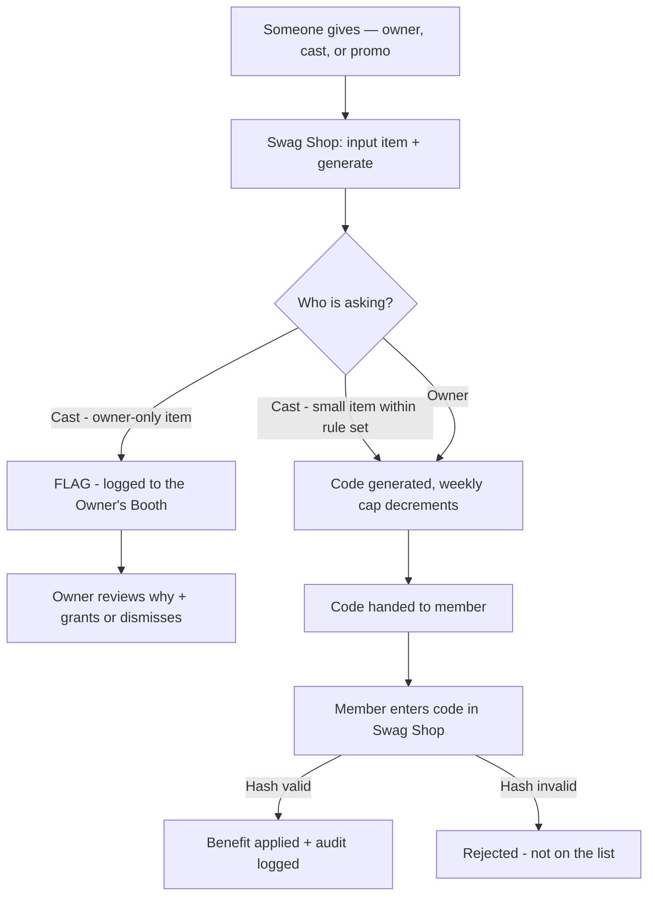

# Club Cheeky — Feature PRD: The Generosity Engine (Swag Shop)

> Status: **BUILT — v0.6-swag-shop** (2026-08-02). Founder's simplified
> design: ONE room, ONE universal unit — the code. This is the AI + visual
> reference; the mermaid flow below is the canonical picture.
> Extends `PRD-foundation.md` (token economy, mission guardrails) and
> `PRD-phase5-wing.md` (the cast — the engine's staff). Companion: `AGENTS.md`.

## 1. TL;DR

The Generosity Engine is a **hidden, always-on system for giving things away**
— memberships, tokens, gifts. It is not a launch stunt; it is how the club
runs. The founder's simplification: **the Swag Shop** — one room, no per-floor
logic, same everywhere. Everything flows through **one universal unit: the
code**. Input what it gives → a code is generated and tied to it → the code
bypasses Stripe and applies the benefit straight to the database → every
grant is logged and tracked by its code.

Four benefits flow through the pipe: **membership** (30-day entitlement),
**tokens**, **gifts** (from the catalog). **Verification is NOT a code** —
that door stays a real ID check (governance + safety).

## 2. The canonical flow (saved visual reference)

## 3. The rule set — the flag job

Per-item rules enforced **centrally in the engine**, so it doesn't matter who
is asking — a confused AI and a hacked caller both get flagged the same way.

| Item                                | Who          | Weekly cap (cast)   |
| ----------------------------------- | ------------ | ------------------- |
| Gold membership                     | cast + owner | 3/week              |
| Platinum / Diamond membership       | owner only   | —                   |
| Token bags (20 / 50 / 100)          | cast + owner | 5 / 3 / 1 per week  |
| Teddy bear / Golden roses / Jewelry | cast + owner | 10 / 5 / 2 per week |
| Champagne / Gift basket             | owner only   | —                   |

- Anything **not listed is owner-only** (fail-closed).
- The cap counts codes generated that week — generate one, one less left.
- Owner-only + cast attempt → **`owner_required` flag**: logged to the
  Owner's Booth with the member + the cast's stated reason ("I need to know
  why they're requesting those items"), and the cast sees "the front desk
  has put in a word with the owner."
- Owner grants bypass caps (the owner IS the supply), but every grant is
  still audited and the whole engine has a fail-closed kill switch
  (`promo_config.engine_enabled`).

## 4. The code lifecycle

1. **Generate** — the actor (owner via the Booth, or the cast via the AI
   shelf) calls the RPC; the rule set is checked; a random hash
   (`SWAG-XXXXXXXX`) is created and **tied to exactly one item** in one row.
2. **Give** — the code is handed out in whatever way (in chat, on a card,
   in an email, a batch of 100 for launch).
3. **Redeem** — the member enters the code in the Swag Shop; the engine
   validates it against that row. No match = invalid. Match = the tied item
   is rewarded (entitlement / ledger / inventory) + an **audit row**.
4. **Log** — the code row records who generated it and who claimed it; the
   benefit grant is in `benefit_grants` (actor, benefit, reason, time).

## 5. Actor access

| Actor                | Can do                                                                   | Enforcement                                          |
| -------------------- | ------------------------------------------------------------------------ | ---------------------------------------------------- |
| **Owner**            | Generate any code, grant directly by email, resolve flags, toggle engine | ADMIN_KEY-gated Booth (`/owner`) + service-role RPCs |
| **Character (cast)** | Small items within rule-set caps, via `[[SWAG:slug]]` in conversation    | Service-role route + DB rule set (hard backstop)     |
| **System**           | Anything (automation)                                                    | Service-role only                                    |
| **Member**           | Redeem codes they've been given                                          | Authenticated RPC; can never mint or read codes      |

## 6. The Owner's Booth (`/owner`)

Keyed page (ADMIN_KEY) — the front desk of the Swag Shop:

- **Engine switch** — kill the whole engine instantly (fail-closed).
- **Generate codes** — item + count + notes → batch codes, click-to-copy.
  This is the launch mechanism: 100 Gold codes in seconds.
- **The flag job** — open flags show the member, the cast member, the item,
  and the cast's reason → **Grant it** (applies directly) or **Dismiss**.
- **Grant directly** — by member email, no code (owner's smooth-over key).
- **The rule set** — live view; caps are one-row tweaks in `swag_rules`.
- **Recent codes + grants** — the audit trail.

## 7. The Swag Shop (`/swag`)

Member-facing redemption: enter a code → benefit lands (floor, wallet, or
stash) → "Your swag" history shows what the club has given. Linked from the
footer. Quiet by design — the engine is hidden until a code finds you.

## 8. The AI shelf

Chaz and Trixie carry a small shelf. Their persona prompt gains a swag note
(allowed items only), and they write `[[SWAG:teddy]]` inline where the code
should appear in their reply. The route converts it to a real code — or, for
a bigger ask, flags the owner (`[[SWAG:champagne|reason]]`). The cast never
promises: if the shelf is empty or the item needs the owner, the front desk
says so in-character.

## 9. Club emails (LOCKED)

| Address                         | Purpose                | Surfaced on                     |
| ------------------------------- | ---------------------- | ------------------------------- |
| `info@smartscott.online`        | General, data/privacy  | Footer, Privacy                 |
| `date.safely@smartscott.online` | Safety                 | Best Practices                  |
| `club.cheeky@smartscott.online` | Rules / club questions | Terms                           |
| `helpdesk@smartscott.online`    | Support                | Footer, Verification escalation |

Single source of truth: `utils/contact.ts`. Routed to the founder's Zoho/CRM.
No mail client (founder's form server later).

## 10. Guardrails (non-negotiable)

- **No dark patterns.** Grants are real, audited, never fake scarcity.
- **Audit trail = governance.** Every grant logs actor/benefit/recipient/
  reason/code — free documentation for `docs/Governance/`.
- **The Three Principles** govern every comp, including flags and denies.
- **Fail-closed.** Engine kill switch; unlisted items are owner-only; no
  authenticated grant exists for minting codes.
- **Verification stays a real ID check.** Never code-granted.

## 11. Validation (2026-08-02)

Live-tested against the hosted DB: owner mints gold/tokens/teddy; Trixie
hits the 10-teddy weekly wall at #11; champagne + diamond from the cast →
`owner_required`; flags log the reason; a real signed-in member redeems all
three benefit types (entitlement + ledger + inventory) with audit rows;
duplicate redemption blocked. Zero test residue. `tsc`/`lint`/`build` green.

## OPEN items

- [ ] Tune the weekly caps (current: gold 3, tokens 20/50/100 → 5/3/1,
      teddy 10, roses 5, jewelry 2 — one-row tweaks in `swag_rules`).
- [ ] Marketing visibility toggle (`surfaces_visible`) when a giveaway page
      is wanted — engine on/off already ships.
- [ ] Owner notification when a flag lands (no mail client — in-Booth for
      now; founder's form server later).
- [ ] Confirm `ADMIN_KEY` is set in Vercel env (the Booth + admin grants
      require it).
