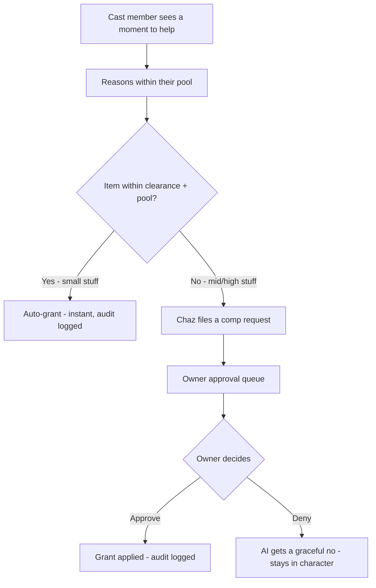

# Club Cheeky — Feature PRD: The Generosity Engine

> Status: **DRAFT (design)** — founder vision captured 2026-08-02, pending build.
> This is the AI + visual reference for how the club gives things away. The
> mermaid flow below is the canonical picture; everything in this doc hangs
> off it.
> Extends `PRD-foundation.md` (token economy, mission guardrails) and
> `PRD-phase5-wing.md` (the cast — the engine's staff). Companion: `AGENTS.md`.

## 1. TL;DR

The Generosity Engine is a **hidden, always-on system for giving things away** —
memberships, tokens, gifts, passes. It is not a launch stunt; it is how the club
runs: launch giveaways, continuous promos, service recovery, and cast members
comping small kindnesses mid-conversation. Everything a member ever receives
free flows through one pipe, is audit-logged, and is **never announced as
scarcity** — it is always "here, this is on us."

Four inputs, one pipe, one audit trail:

1. **Claim codes** — one-use codes for the launch (100 Gold / 50 Platinum /
   10 Diamond) and any campaign. Redeem → full 30-day membership, member flows
   through the app exactly like a paying member (no special area, no test flag).
2. **Staff authority (the AI, budgeted)** — the cast can grant small things
   in-character, within per-character pools, through a clearance ladder.
3. **The Owner's key** — founder grants bypass every limit; high-ticket items
   escalate to the owner's approval queue.
4. **System/automation** — milestone bonuses, retention gestures, etc.

## 2. The canonical flow (saved visual reference)

## 3. The clearance ladder (three rungs)

The engine is not one big "write to DB" button. Every benefit type has a
clearance rung, enforced **server-side in the database** — the cast can *ask*
for anything, but the DB only honors what their clearance + pool allow.

| Rung | Who decides | What flows through | Example |
|---|---|---|---|
| **1 — AI-auto** | The character, instantly | Small gifts, small token drops, 24h guest pass | Trixie slides a struggling member a teddy bear |
| **2 — AI-recommend → owner approves** | Founder via approval queue | Mid grants: a week of Gold, a real token bundle, featured gifts | Chaz smooths an escalation with 1 week Gold + 100 tokens |
| **3 — Owner-only** | Founder only | Diamond memberships, the gift basket, champagne | The car-accident comp (see §6) |

Rules:

- The AI **cannot grant above its rung** — a confused or buggy cast member
  physically cannot insert a Level-3 grant. Worst case it asks the owner
  nicely. That is the granular clearance the founder asked for: not "the AI can
  write," but "the AI can write *these specific things*."
- **No fake promises:** because the engine won't honor above-rung grants, the
  cast can never oversell ("I'll talk to the owner" is honest — it really does
  go to the owner).

## 4. Pools that force reasoning

Each character gets a **monthly comp budget expressed in token-worth**, plus
cooldowns and per-grant caps. The cast has to *reason* about spending, not
spray.

| Character | Pool (illustrative) | Typical comps |
|---|---|---|
| Trixie (floor scout) | ~500 tokens/month | Mini gifts (teddy bear = 25), small token drops |
| Chaz (manager) | ~2,000 tokens/month | Mid grants (week of Gold ≈ 250), escalations |
| Valentina (hostess) | VIP-only gestures | Comped event entry, VIP niceties |
| Brutus / DJ | No comp pool | Never hand out — they protect/spin, not comp |

Pool exhausted or item above rung → **escalate, don't stretch.**

## 5. DB enforcement model

- One **grant pipe** (`grant_benefit`) that atomically writes the benefit
  (entitlement grant / token ledger / gift inventory / pass) **and** an audit
  row: actor (owner | character slug | system), recipient, benefit, value,
  reason, rung, expires.
- **Per-type grant RPCs** with clearance baked in (`grant_gift` L1,
  `grant_membership` L2/L3 by tier, `grant_basket` L3). Service-role only —
  members can never grant themselves anything (same rule as tokens).
- **Comp requests** (L2/L3) are *pending* rows — nothing is applied until the
  owner approves.
- **Budgets** enforced inside the RPCs: pool balance, cooldowns, per-grant
  caps. A character that spends its pool is done until the owner tops it up.

## 6. Escalation — the canonical case (OPEN pattern)

Founder's example, captured as the reference scenario:

> A member bought a Diamond membership, then was in a car accident and spent
> 30 days in the hospital — never got to use it. He mentions it to the cast, or
> files it. The AI picks up on it. **It escalates to the owner** (Level 3 —
> diamond membership, owner-only). The owner makes a judgment call — possibly
> asking the member to send proof (e.g., hospital paperwork) to a club email —
> then approves a 30-day extension.

Rules that fall out of this:

- **Anything above a rung, or outside the playbook, escalates.** We can't
  enumerate every incident — the ladder handles the ones we can't predict.
- **The owner is the final judgment call.** The AI recommends; the owner
  decides. The AI stays in character either way (approve → celebration;
  deny → graceful, honest no — never a hard rejection).
- **Proof can be requested.** The owner may ask the member to email evidence
  to a club address; that happens outside the app, owner-side.

## 7. The Owner's Booth — approval surface (proposal)

The owner's queue is a protected page (ADMIN_KEY-gated, like the existing
complimentary-grant action), showing each pending comp request:

- **Who:** member (profile + primary photo)
- **Who flagged it:** Trixie / Chaz / Valentina + the conversation snippet
- **What:** the benefit + value (1 week Gold, diamond comp, gift basket…)
- **Why:** the cast's reason, in their words
- **Rung:** L2 (recommended) or L3 (owner-only)

Two actions: **Approve** (instant grant through the pipe, audit logged) and
**Deny** (graceful in-character no). Optional note field (e.g., "asked for
hospital proof").

**Notifications (RESOLVED):** no mail client needed. Member-facing contact
is via the club email addresses below (mailto links, routed to the founder's
Zoho/CRM). Owner notifications for comp requests stay in-app via the Booth
queue; a subdomain contact form (founder's own form server, Traefik-routed)
is the later upgrade path.

## 8. Club emails (LOCKED — founder-provided 2026-08-02)

Club-flavored inboxes at `smartscott.online`, all routed to the founder's
Zoho account for parent `smartscott.com` and fielded by the CRM there:

| Address | Purpose | Surfaced on |
|---|---|---|
| `info@smartscott.online` | General club info, data/privacy questions | Footer, Privacy |
| `date.safely@smartscott.online` | Safety concerns — app or on a date | Best Practices |
| `club.cheeky@smartscott.online` | Rules / membership / club questions | Terms |
| `helpdesk@smartscott.online` | Support (ID-check escalation, account help) | Footer, Verification escalation |

Single source of truth in code: `utils/contact.ts`. Later: a subdomain
contact form (founder's own form server — SSL, Traefik routing, analytics)
that members click through to the right division. No third-party mail client.

## 9. Guardrails (non-negotiable)

- **No dark patterns.** Grants are always real, always logged, never framed as
  fake scarcity ("we're giving you this because we see you" — never "limited
  time, act now").
- **Audit trail = governance.** Every grant logs actor/benefit/recipient/
  reason/rung — free documentation for `docs/Governance/`, and a complete
  record if a member ever claims "the AI promised me X."
- **The Three Principles** (PRD-phase5-wing §2.5) govern every comp, including
  denies — encouraging, honest, never writing anyone off.
- **Fail-closed.** An engine-wide on/off switch kills all grants instantly;
  surfaces (marketing giveaway page) show/hide without a deploy.

## 10. Build order (proposed)

1. **Grant pipe + audit + clearance matrix** — the DB rungs; everything hangs
   off this.
2. **The Owner's Booth** — comp requests + approve/deny page + queue.
3. **Budget pools** per character (with cooldowns/caps).
4. **Claim codes** — one-use, launch + campaigns.
5. **AI wiring** — the cast asks through the pipe via a grant tool in
   `app/api/agent`, subject to rung + pool.
6. ~~Mailer~~ — **not needed** (see §7 RESOLVED); club email addresses are live
   via `utils/contact.ts` (see §8).

## OPEN items (need founder sign-off before build)

- [x] Mailer choice — **RESOLVED:** no mail client; Zoho/CRM + founder's own
      form server later.
- [x] Club email addresses — **LOCKED:** info / date.safely / club.cheeky /
      helpdesk @smartscott.online (see §8).
- [ ] Exact pool sizes / cooldowns per character (illustrative above).
- [ ] Claim-code generation UX (owner page generates + copies codes).
- [ ] Whether the owner wants a one-click "extend membership" button in the
      Booth (vs. editing the DB by hand — founder's stated preference).
