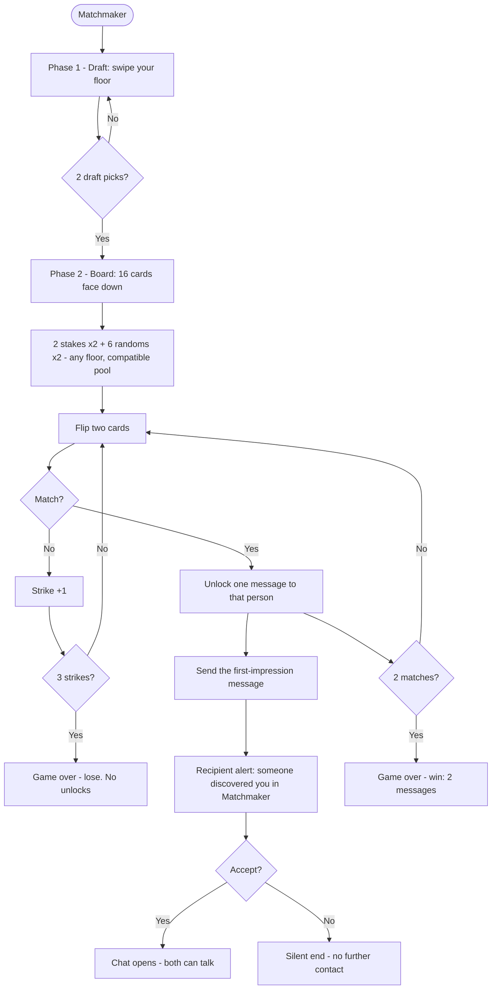

# Club Cheeky — Feature PRD: Matchmaker

> Status: **BUILT** (2026-08-08) — shipped as the third spark mode under the
> Spark hub (`/browse`), sibling to L³ (docs/PRD-l3.md). Two PRD decisions
> were amended during the build by the founder (see §4 and §6); everything
> else shipped as drafted. Live-tested end to end (`tests/matchmaker.live.test.mjs`).
> Extends PRD-foundation.md. Companion: AGENTS.md.

## 1. TL;DR

**Matchmaker is a memory game that earns a first-impression message.**
The user plays a 4×4 board of face-down cards (8 people, 2 copies each);
matching a pair **unlocks one message to that person** — even if that person
has never liked them back. The intro is **earned by play, never bought** —
the generosity engine applied to the most-gated thing in dating.

**"Always a winner."** The 6 random faces are wildcards, so the two unlocked
pairs may not be the two people the user staked — but any match is a win:
an unlocked message to *someone*. The user may send it or keep it; the
recipient may accept or decline **silently**. Wins are messages; losses are
quiet.

## 2. Why

- **Cold-start**: new members get a real chance to start a conversation
  before anyone has liked them — the #1 "why is this empty" problem.
- **Activity**: the game manufactures views of people the user would never
  have seen, plus a reason to keep coming back (plays/day scale by floor —
  §5: 2 free, up to 5 for Diamond).
- **Ownable**: a memory game is a signature, not a swipe clone — "Matchmaker"
  becomes a room people talk about.

## 3. The flow

## 4. Floor rules

- **Drafts (the swipe phase): your floor or beneath.** (Amended during
  build: the founder opened drafts to your floor *and below* — the paid
  floors keep their exclusivity above you, but the downstairs is fair
  game.) No free-tier peeks at paid-floor faces.
- **Randoms (the board): any floor, from the compatible pool.**
  Random *within* the same `compatible()` filter the board uses (no
  guy-on-guy boards), verified-only is moot (you can't get in the club
  unverified — the pool is the whole club). All random for now;
  floor-weighting (same-floor common, upper-floor rarer) is a later tune.
- **Cross-floor unlocks are earned + consented.** Matching an upper-floor
  face earns one intro; the recipient accepts or declines silently.
- **Game swipes are draft picks, not real likes.** No accidental matches
  from the swipe phase. If a draft pick has already liked *you* — that's a
  real mutual: it surfaces as a normal match and leaves the board.

## 5. Limits & economy

- **Plays per day scale with the floor (2/3/4/5)** — every paid floor steps
  up, mirroring the messaging ladder (75/15 → unlimited/40 → unlimited/100):

  | Floor | Plays/day |
  |---|---|
  | Silver (free) | 2 |
  | Gold | 3 |
  | Platinum | 4 |
  | Diamond | 5 |

  The dial is server-side (same `current_tier` case pattern as the message
  caps) so a one-line change rebalances the whole ladder. Each play is one
  full board. **5 is the absolute ceiling** — it caps recipient noise and
  keeps upper-floor randoms rare, so a Diamond board still feels special.
  Rewards spenders; never shrinks the free tier.
- **Unlock messages ride their own allowance** — they never eat the free
  tier's 5-new-conversations cap and never shrink it. The game *is* the
  gate; no double-penalty.
- **No tokens, no purchases, no boosts.** The intro is earned by play.
- The daily plays cap is server-side (same `bump_rate_limit` pattern) so it
  holds across devices.

## 6. Guardrails (binding)

- **Silent loss, public win — with the rebound amendment (founder).** A
  declined unlock ends *contact* with no follow-up, no nudge, no "they'd
  love to hear from you." The recipient stays silent. But the *sender is
  told* the outcome — wrapped in the win: "they declined, but you still
  won the game — your [Matchmaker-exclusive gift] is in your inventory."
  The brain anchors on the gift; the decline becomes the next shot, not a
  bruise (the rebound engine, §9a).
- **No dark patterns.** The board is honest chance + memory skill; no
  fake activity, no pity mechanics, no "almost!" pressure loops.
- **Safety rails reused.** The recipient's alert carries report/block;
  the unlock message flows through the existing messaging safety.
- **The recipient notice mechanic is DECIDED** (see §9a): pure
  "someone discovered you in Matchmaker" alert with accept/decline — no
  like-back countdown window.

## 6a. The decline economy — Matchmaker-exclusive gifts (founder, built)

- **Four exclusive gifts, one per floor**, never for sale: The First Spark
  (silver) 🔥, The Golden Ticket (gold) 🎫, The Platinum Pass (platinum) 💠,
  The Diamond Key (diamond) 🗝️. `buy_gift` refuses them (`gift_not_purchasable`).
- **Accept** → the *recipient* earns the **sender's-floor** variant. The
  collectible pull: accept from a Gold face → the Gold gift; a Diamond
  face → the Diamond gift — "Dang, I need that one for the set."
- **Decline** → the *sender* earns their **own floor's** variant as the
  consolation. It lands in inventory (`available`), re-giftable through
  the normal gift flow (silent mini-kind gesture), and is linked to the
  unlock so history shows exactly what was earned.
- This seeds the Gems collectible economy: the first "can't buy, only
  earn" items in the club.

## 7. UX sketch

- Phase 1: the spark-lab swipe strip (drafts only — your floor, compatible).
- Phase 2: the board — 16 cards in a 4×4 grid, face down, gold-trimmed
  (the box pattern). Card backs carry the Matchmaker mark.
- Phase 3: flip two; matched pair flips face-up and celebrates; strike
  meter (3 hearts / 3 sparks) at the top.
- Phase 4: unlock card — "You found X — send your first impression"
  (one message, then it's sent); recipient side has the alert + accept/
  decline (silent).
- Mobile: 4×4 grid fits a phone screen; the swipe phase reuses the Spark
  card strip.

## 8. Metrics (owner dashboard)

- Plays/day, match rate per board, strike distribution.
- Unlock send rate (how many unlocked messages actually get sent).
- Recipient accept rate; cross-floor accept rate.
- Cold-start effect: new members who unlock within their first 48h.

## 9. Decisions (formerly open questions)

1. **Recipient notice** — **decided (a) + the rebound**: pure alert with
   accept/decline; no like-back window. The decline tells the sender with
   a consolation gift (§6/§6a) — the rebound engine, first implementation.
2. **Randoms pool** — verified-only confirmed; moot, everyone in the club
   is verified. The pool is the whole club, any floor.
3. **Board balance** — shipped as drafted (8 pairs / 2-match win / 3
   strikes); tune after first playtest.
4. **The sender learns of a decline** — decided yes, gift-wrapped (§6).

## 10. Out of scope (for now)

- Purchasable extra plays — no (the game is the gate; buying plays would
  make it a paywall).
- Streak pressure ("come back or lose your board") — no.
- Matchmaker-themed variants (speed rounds, team boards) — later, same
  weekly cadence.
