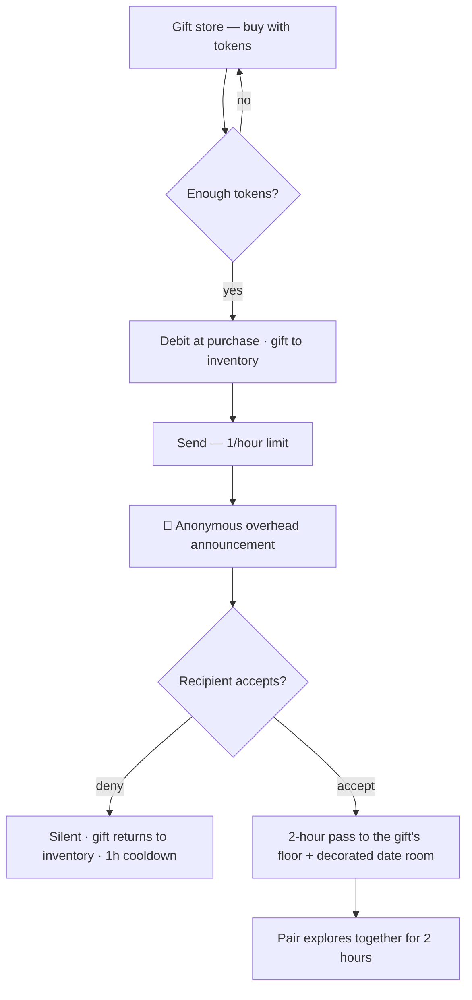

# Club Cheeky — Phase 5 Feature PRD: The Store Wing

> Status: **DRAFT** — locked decisions captured from founder brainstorm (2026-08-02).
> Open items are marked **OPEN** and need founder sign-off before build.
> Source of truth relationships: this doc extends `PRD-foundation.md` (Pillar 2 event
> engine, Pillar 3 token economy). Companion: `AGENTS.md` (how we work).

## 1. TL;DR

Once a member is matched, the app's job changes: **the match is the beginning,
not the end.** Three modules make the club worth staying in after the match:

1. **The Gift Store** — tokens buy gifts (per-floor + a universal basket); the
   send fires an anonymous overhead announcement; acceptance grants a **2-hour
   pass** to the gift's floor plus a decorated date room.
2. **Couple Trivia ("Date Night")** — matched pairs only, free, 15-second
   huddle, mutual-tap answers, couples compete on a leaderboard.
3. **The Characters** — NPC personas (Brutus, the DJ, the bartender…) with
   relationship levels, triggered dialogue moments, and collectible character
   cards. Founder supplies personas + graphics; the engine is asset-driven.

Shared principle: **the club's calendar IS the product** — every activity is a
pluggable mechanic (grid / rotation / round-based / economy), stale events get
swapped, never patched.

## 2. Why (retention thesis)

- Incumbents abandon users at the match ("leave you to your own demise").
- Club Cheeky unlocks **matched-only content** — stuff couples can do that
  unmatched users cannot, which makes matching the *entry point*, not the finish.
- The **game side** (characters, badges, atmosphere) keeps non-daters and
  dry-spell users coming back: the club is a place to *be*, not a feed to check.
- Word of mouth: "I was on Club Cheeky for three hours" — time-in-app is the
  marketing engine.

## 2.5 House Rules — the Three Principles (the constitution)

Every feature **and every character voice** is built on three principles. They
are the "encourageable, not incorrigible" rule — the app never writes anyone
off, even when someone is struggling. Founders distill: Brutus is rough, but
his language always follows these.

1. **Honest.** No dark patterns, no fake likes, no artificial scarcity, no
   gouging. What you see is what it is. (Mission guardrails, `AGENTS.md`.)
2. **Encouraging.** Never write anyone off. Silent losses stay private; wins
   are celebrated; and when someone keeps missing, the app steps in to help
   them up (see Module 4 — Center Stage).
3. **Fun and free at the base.** The free tier stays genuinely free and fun;
   everyone gets in with an ID. Money buys floors, never entry.

> These principles are enforced in code wherever possible — not just copy
> (e.g. the miss-streak rescue trigger is the Encouraging principle as a rule).

## 3. Module 1 — The Gift Store

### 3.1 Catalog (LOCKED — expanded 2026-08-02)

Two tiers per floor: **✨ featured** (announces on the ticker; accept = 2-hour
pass + date room) and **🎁 mini** (silent gesture; accept just opens the
chat). Five items per floor (1 featured + 4 minis) + the basket.

| Floor | Featured (announces + pass) | Minis (silent gestures) |
|---|---|---|
| Silver | 🧸 Stuffed Bear — 25 | 🦆 Rubber Duck 10 · 🍭 Candy Hearts 12 · 🐰 Plush Bunny 15 · 🐻 Mini Bear 20 |
| Gold | 🌹 Golden Bouquet — 50 | 🎲 Golden Dice 25 · 🍫 Gold Bar 30 · 🕶️ Gold Shades 35 · ✒️ Gold Pen 40 |
| Platinum | 💎 Jewelry — 100 | 🖊️ Metal Pen 45 · 🔑 Platinum Keychain 55 · 🎩 Velvet Bow Tie 65 · 🥃 Pocket Flask 75 |
| Diamond | 🍾 Champagne — 200 | 👓 Diamond Shades 80 · 🖋️ Fountain Pen 100 · 🎩 Top Hat 120 · 💎 Crystal Heart 150 |
| **Every floor** | 🧺 The Gift Basket — **300** (all four, 75 off) | — |

- Minis are the icebreaker: show interest without the first-line anxiety.
  They are priced under their floor's featured gift and never announce.
- Featured gifts + the basket announce (send-only, anonymous) and unlock the
  pass + date room on accept. Minis unlock only the conversation.

### 3.2 Rules (LOCKED)

- **Buy down, never up.** You may buy gifts from your floor and below. A
  Diamond may send a teddy bear; a Silver may never buy the champagne.
- **Tokens debit at purchase** — the gift lives in the sender's **personal
  inventory** (server-side ledger + inventory table).
- **Send limit: one gift offer per hour** (global, not per gift). Prevents
  ticker flooding / rejection spam loops.
- **Denied gift → returns to inventory** with a 1-hour cooldown; re-aim at
  someone else. No refund (tokens already spent at purchase), no item loss.
- **Accepted gift → consumed** (the bottle's popped).
- **Announcement: anonymous to the club** — "a bottle of champagne just
  popped!" No sender, no recipient, no outcome. The gamble: anonymity lowers
  acceptance rate, and that's accepted.
- **Recipient sees everything privately** — the incoming gift notification in
  their message area shows the sender's profile + **photo** (first thing
  anyone wants to know), with accept / deny.
- **Accept → 2-hour pass to the gift's floor** (reuses the `guest_passes`
  entitlement chain — `current_tier()` honors it automatically) **plus a
  decorated date room** (certificate-room skin machinery, gift-themed).
- **Basket's pass = the sender's floor** (OPEN — my lean; prevents a Silver
  handing out Diamond passes).
- **Blocks respected** — cannot gift someone who blocked you.

### 3.3 Flow

## 4. Module 2 — Couple Trivia ("Date Night")

### 4.1 Rules (LOCKED except where noted)

- **Matched pairs only.** No solo play. Unmatched users see the door, not the game.
- **Free to play.** No token entry — matched couples already paid to get here
  (verification / events / gifts). Tokens stay in the gift store.
- **Round structure:** a multiple-choice question drops to both partners
  simultaneously; **15-second huddle** in their existing chat to agree; the
  couple's answer locks only when **both tap the same option** (the Dance
  Floor mutual-pick mechanic, used for agreement).
- **Couples compete against couples** — per-round leaderboard.
- **Rewards: badges + streaks + collectibles only** (Date Night badge,
  7-night streak, character-card tie-ins). No token rewards — pride is free,
  tokens are the economy.
- **Entry: on-demand first** (a "Date Night" button inside a matched chat);
  scheduled club-wide couple tournaments later — same engine (see §6).
- Trivia content: curated question bank; swap-able like any mechanic.

## 5. Module 3 — The Characters

### 5.1 Vision (LOCKED direction, mechanics OPEN)

The club is populated by players **and** characters — MMORPG atmosphere.
Characters have relationship levels, greet you at milestones, and become
collectible relationships over time. The game side keeps non-daters coming back.

### 5.2 Cast (founder-driven)

| Character | Role | Where they live |
|---|---|---|
| **Brutus** | The Bouncer — verification, consent, safety | Door / verification flow |
| **The DJ** | The Floor — announcements, song chat energy | Events / matches |
| **The Bartender** | The Store — gifts come from behind his bar | Gift store |
| **The Hostess** | The Calendar — events, trivia nights | Events / date nights |
| **The Coat Check** | Inventory — "check your coats" (gifts stash) | Inventory UI |

### 5.3 Mechanics (small first — OPEN details)

- **Relationship levels** per character (friendship meter): verification
  (Brutus), first event (DJ), first gift (Bartender), first trivia (Hostess).
- **Triggered dialogue moments** — short (~30s) scripted scenes at milestones
  and occasional ambient moments. Scripted and cheap now; DeepSeek-backed
  conversational characters later (connector already linked in Vercel).
- **Collectible character cards** — feed Phase 5 Gems/collectibles economy.
- **Guardrail:** characters are *clearly* characters (like the DJ's
  announcements). No NPC-driven fake engagement, no fake likes from
  characters. Scripted fun is honest fun.

### 5.5 The AI layer — the Cast goes live (shipped 2026-08-02)

- **The Concierge**: a floating 🎭 button on every page opens a chat with the
  cast — pick a character, talk in-character. DeepSeek (`deepseek-chat`)
  backbone with each persona's `persona_prompt` as its system prompt, loaded
  live from the DB (update a persona = update the character instantly).
- **Grounded + real tools**: the agent receives the member's private context
  (floor, tokens, verification) and can call `get_next_events` to recommend
  real rooms. No invented matches, likes, prices, or events — ever (House
  Rules in the system prompt; the Three Principles enforced in code).
- **One backbone, N personas**: per-request routing costs nothing idle and
  scales by adding personas, not servers. The multi-agent orchestrator
  (Surgical Weave, memory substrate) from the synthesis report remains
  future work.
- **Cost guards**: history capped, `max_tokens` capped, one tool round-trip.
- Requires `DEEPSEEK_API_KEY` (Vercel connector + `.env.local`).

### 5.4 Asset contract (founder → app)

- **One character = one folder:** `public/personas/{slug}/` (e.g.
  `public/personas/brutus/`) with `portrait`, full-body shots, and a 6–10s
  scene video.
- **Asset-driven engine:** a `characters` table stores name, role,
  image/video URLs, greeting lines, relationship thresholds, and
  `persona_prompt` (reserved for the conversational layer). Dropping a new
  character in = new row + folder, no code change.
- Founder's persona system ("the AI thinks it IS the persona") plugs into
  `persona_prompt` when we turn on conversational dialogue.

## 6. Shared Principle — The Modular Club (LOCKED as philosophy)

- The **event-driven platform** framing: the calendar is the product.
- Every activity is a **pluggable mechanic** — grid (Dance Floor), rotation
  (Speed Dating), round-based (Trivia), economy (Gifts), atmosphere
  (Characters). New kinds slot into the existing events/entries/token engine
  with no new architecture.
- **Stale events get swapped, not patched**: retire a kind → the scheduler
  stops creating it → the new hot thing takes the slot (mimic what's popping
  IRL).
- This is why everything stays modular *now*, while it's cheap: the building
  can change its whole personality without a remodel.

## 6.5 Module 4 — Center Stage (miss-streak rescue)

The Encouraging principle as code. When a member keeps missing — e.g. **no
match in the last five events** (or a run of denied gifts) — the engine
triggers a rescue:

- **What happens (OPEN):** a "center stage" moment — featured placement in
  the next grid, a hype announcement, a spotlight badge. The goal is to get
  hype *around* them and give them a genuine boost, never a pity signal
  (silent to everyone else — see Honest + Encouraging).
- **Trigger (OPEN):** consecutive no-match events threshold (5 proposed);
  denied-gift runs; configurable per floor.
- **Guardrails:** no dark patterns — the boost is real visibility, not a fake
  like or a manufactured match. The recipient never gets an artificial "win".

## 7. Decisions Log (all previously open items now LOCKED)

1. **Basket pass floor** — LOCKED: the pass = the **sender's floor** (keeps
   "never buy above your floor" honest; a Silver's basket pass is the club
   floor, a Diamond's is the whole building).
2. **Trivia entry** — LOCKED: **on-demand in-chat first** (a "Date Night"
   button inside a matched chat); scheduled club tournaments later, same
   engine.
3. **Character rewards** — LOCKED: badges, streaks, and collectible cards
   only; no token rewards (keeps the economy clean).
4. **Gift-send cooldown** — LOCKED: 1 offer/hour, **global** across all
   gifts.
5. **Announcement ticker** — LOCKED: **in-app only**, never on the
   marketing site.

## 8. Roadmap Placement

- **Phase 5 — Economy+** (`PRD-foundation.md` §11): Gems/collectibles, gifts,
  giveaways, referral dashboard. The Store Wing is Phase 5's anchor.
- Build order (LOCKED): **Characters schema + asset pipeline** (shipped
   2026-08-02 — tables, seed cast, `public/personas/{slug}/` contract) →
   **Gift Store** (shipped 2026-08-02 — catalog incl. mini tier, inventory,
   sends, ticker, date rooms) → **Couple Trivia** (shipped 2026-08-02 —
   25-question bank, 5 packs, mutual-tap engine, in-chat Date Night panel,
   couples leaderboard) → **Center Stage** (shipped 2026-08-02 — 5-miss
   streak triggers a 24h public spotlight in the grid; streak stays private;
   a match clears it).
- The Hourly Playlist (v0.4) already proves the modular calendar; these
  modules extend it.
